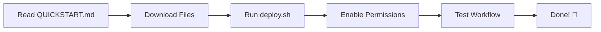
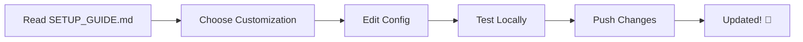
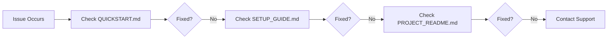

# 📚 Documentation Index

<div align="center">

**Complete guide untuk GitHub Profile Auto-Update System**

Pilih dokumentasi sesuai kebutuhan Anda

</div>

---

## 🚀 Quick Navigation

### For New Users

| Document | Purpose | Time Needed |
|----------|---------|-------------|
| [**QUICKSTART.md**](QUICKSTART.md) | Setup tercepat - langsung jalan | ⏱️ 5 menit |
| [**README.md**](README.md) | Profile README (hasil akhir) | 👁️ View only |

### For Configuration

| Document | Purpose | Time Needed |
|----------|---------|-------------|
| [**SETUP_GUIDE.md**](SETUP_GUIDE.md) | Panduan lengkap + customization | ⏱️ 15 menit |
| [**PROJECT_README.md**](PROJECT_README.md) | Technical documentation | ⏱️ 20 menit |

### For Developers

| File | Purpose | Language |
|------|---------|----------|
| `update_readme.py` | Main script | 🐍 Python |
| `test_local.py` | Testing script | 🐍 Python |
| `.github/workflows/update-readme.yml` | Automation workflow | ⚙️ YAML |
| `deploy.sh` | Deployment script | 🔧 Bash |

---

## 📖 Document Details

### 1. QUICKSTART.md ⚡
**→ Start here if you want to get running ASAP**

```
✅ File structure
✅ Permission setup
✅ Deployment steps
✅ Quick configuration
✅ Basic troubleshooting
```

**Best for:** Beginners, quick setup, immediate results

---

### 2. SETUP_GUIDE.md 📘
**→ Comprehensive guide untuk full understanding**

```
📋 Detailed installation steps
⚙️ Advanced configuration options
🔧 Customization examples
🐛 Complete troubleshooting guide
💡 Tips & tricks
🎯 Performance optimization
```

**Best for:** Users who want deep understanding, advanced customization

---

### 3. PROJECT_README.md 📄
**→ Technical documentation untuk developers**

```
🏗️ System architecture
🔧 How it works internally
📊 API integration details
🔐 Security & permissions
📈 Performance metrics
🤝 Contributing guidelines
```

**Best for:** Developers, contributors, technical users

---

### 4. README.md (Profile) 👤
**→ Your actual GitHub profile README**

```
📝 Auto-generated content
🎨 Tech stack badges
📊 GitHub statistics
🏆 Trophies & achievements
```

**Best for:** Viewing your profile result

---

## 🎯 Choose Your Path

### Path 1: Quick Setup (Recommended)
```
1. Read QUICKSTART.md (5 min)
2. Follow steps exactly
3. Done! ✅
```

### Path 2: Learn & Customize
```
1. Skim QUICKSTART.md (2 min)
2. Read SETUP_GUIDE.md (15 min)
3. Customize to your needs
4. Deploy! ✅
```

### Path 3: Deep Dive
```
1. Read PROJECT_README.md (20 min)
2. Read SETUP_GUIDE.md (15 min)
3. Modify source code
4. Test locally
5. Deploy with custom changes ✅
```

---

## 📁 Complete File Structure

```
Kyugito666/                              # Profile repository
│
├── 📄 README.md                         # Main profile README
├── 📚 INDEX.md                          # This file - documentation index
│
├── 📖 Documentation/
│   ├── QUICKSTART.md                    # 5-minute setup guide
│   ├── SETUP_GUIDE.md                   # Comprehensive guide
│   └── PROJECT_README.md                # Technical documentation
│
├── 🐍 Scripts/
│   ├── update_readme.py                 # Main update script
│   ├── test_local.py                    # Local testing script
│   └── deploy.sh                        # Automated deployment
│
├── ⚙️ Configuration/
│   ├── .github/workflows/
│   │   └── update-readme.yml            # GitHub Actions workflow
│   ├── .gitignore                       # Git ignore rules
│   └── requirements.txt                 # Python dependencies
│
└── 🎨 Assets/ (optional)
    └── duong2.gif                       # Profile banner
```

---

## 🔄 Typical User Journey

### First Time Setup



### Customization



### Troubleshooting



---

## 📋 Checklist

Use this checklist to track your progress:

### Setup Phase
- [ ] Downloaded all required files
- [ ] Read QUICKSTART.md
- [ ] Created proper directory structure
- [ ] Uploaded files to GitHub
- [ ] Enabled workflow permissions

### Testing Phase
- [ ] Ran local test (optional)
- [ ] Triggered manual workflow
- [ ] Workflow completed successfully
- [ ] README updated correctly
- [ ] Tech stack matches repos

### Customization Phase (Optional)
- [ ] Read SETUP_GUIDE.md
- [ ] Added custom tech badges
- [ ] Configured schedule
- [ ] Added ignored languages
- [ ] Tested custom configuration
- [ ] Pushed changes

### Maintenance Phase
- [ ] Monitor workflow runs
- [ ] Check for updates
- [ ] Update documentation if needed
- [ ] Share with community

---

## 🆘 Getting Help

### Self-Service Resources

| Issue Type | Where to Look | Expected Time |
|------------|---------------|---------------|
| Setup problems | QUICKSTART.md → Troubleshooting | 5 min |
| Configuration | SETUP_GUIDE.md → Configuration | 10 min |
| Technical details | PROJECT_README.md → How It Works | 15 min |
| Code errors | test_local.py → Run diagnostics | 5 min |

### Contact Support

| Channel | Best For | Response Time |
|---------|----------|---------------|
| 📧 Email: siti007.sj@gmail.com | Detailed questions | 24-48 hours |
| 💬 Telegram: [@i011100110110010101100101u](https://t.me/i011100110110010101100101u) | Quick questions | Few hours |
| 🐛 GitHub Issues | Bug reports | 1-2 days |
| 💡 GitHub Discussions | Feature requests | 2-3 days |

---

## 📊 Features Overview

### Core Features Matrix

| Feature | Status | Documentation |
|---------|--------|---------------|
| Auto Language Detection | ✅ Working | SETUP_GUIDE.md |
| Daily Auto-Update | ✅ Working | SETUP_GUIDE.md |
| Manual Trigger | ✅ Working | QUICKSTART.md |
| Category Grouping | ✅ Working | PROJECT_README.md |
| Custom Badges | ✅ Working | SETUP_GUIDE.md |
| Fork Filtering | ✅ Working | PROJECT_README.md |
| Rate Limit Handling | ✅ Working | PROJECT_README.md |
| Local Testing | ✅ Working | QUICKSTART.md |

### Planned Features

| Feature | Status | ETA |
|---------|--------|-----|
| Language Percentages | 🔄 Planned | v1.1 |
| Wakatime Integration | 🔄 Planned | v1.1 |
| Private Repo Support | 🔄 Planned | v1.2 |
| Web Dashboard | 💡 Idea | v2.0 |
| AI Insights | 💡 Idea | v2.0 |

---

## 🎓 Learning Resources

### For Beginners

**Never used GitHub Actions before?**
1. Start with QUICKSTART.md (just follow steps)
2. Watch workflow run in Actions tab
3. Read "How It Works" in PROJECT_README.md
4. Experiment with customization

**New to Python?**
- You don't need to know Python to use this!
- Just follow QUICKSTART.md
- For customization, see examples in SETUP_GUIDE.md

### For Advanced Users

**Want to contribute or fork?**
1. Read PROJECT_README.md completely
2. Understand the architecture
3. Check Contributing guidelines
4. Test locally before pushing

**Want to build similar tools?**
- Study `update_readme.py` structure
- Learn GitHub API integration
- Understand workflow automation
- See PROJECT_README.md → How It Works

---

## 🔗 External Resources

### Badges & Icons
- [Shields.io](https://shields.io/) - Badge generator
- [Simple Icons](https://simpleicons.org/) - Icon library
- [Badges 4 README](https://github.com/alexandresanlim/Badges4-README.md-Profile) - Badge collection

### GitHub Resources
- [GitHub Actions Docs](https://docs.github.com/en/actions)
- [GitHub REST API](https://docs.github.com/en/rest)
- [Awesome GitHub Profile README](https://github.com/abhisheknaiidu/awesome-github-profile-readme)

### Tools & Utilities
- [Crontab Guru](https://crontab.guru/) - Cron schedule helper
- [YAML Validator](https://www.yamllint.com/) - Validate YAML syntax
- [Markdown Preview](https://markdownlivepreview.com/) - Preview markdown

---

## 🎯 Use Cases

### Use Case 1: Student/Learner
**Scenario:** Belajar banyak bahasa baru, ingin profile reflect progress

**Solution:**
```
→ Setup auto-update (QUICKSTART.md)
→ Profile always shows latest skills
→ Impress recruiters with up-to-date tech stack
```

### Use Case 2: Full-Time Developer
**Scenario:** Banyak repo, sering ganti tech, malas update manual

**Solution:**
```
→ Setup dengan custom schedule (SETUP_GUIDE.md)
→ Add filter untuk work repos only
→ Auto-update weekly
```

### Use Case 3: Open Source Contributor
**Scenario:** Contribute ke berbagai project dengan tech berbeda

**Solution:**
```
→ Setup auto-detect semua languages
→ Showcase diversity of contributions
→ Add custom categories untuk frameworks
```

### Use Case 4: Tech Lead/Manager
**Scenario:** Manage multiple repos, ingin overview tech yang digunakan

**Solution:**
```
→ Setup dengan stats tracking
→ Add summary report generation
→ Monitor team's tech diversity
```

---

## 🔍 FAQ Navigator

### Setup Questions
**Q: Berapa lama setup?**
→ See: QUICKSTART.md → "5 minutes setup"

**Q: Butuh pengetahuan programming?**
→ See: QUICKSTART.md → "Prerequisites"

**Q: Bisa untuk private repos?**
→ See: SETUP_GUIDE.md → "Private Repository Support"

### Configuration Questions
**Q: Cara ubah jadwal update?**
→ See: SETUP_GUIDE.md → "Workflow Schedule"

**Q: Cara tambah bahasa baru?**
→ See: SETUP_GUIDE.md → "Add New Language"

**Q: Cara ignore bahasa tertentu?**
→ See: SETUP_GUIDE.md → "Ignore Certain Languages"

### Technical Questions
**Q: Bagaimana detection bekerja?**
→ See: PROJECT_README.md → "How It Works"

**Q: API rate limits?**
→ See: PROJECT_README.md → "Performance & Rate Limits"

**Q: Security concerns?**
→ See: PROJECT_README.md → "Security & Permissions"

---

## 📈 Version History

### Current Version: 1.0.0

**Included Documents:**
- ✅ README.md (Profile)
- ✅ QUICKSTART.md
- ✅ SETUP_GUIDE.md
- ✅ PROJECT_README.md
- ✅ INDEX.md
- ✅ update_readme.py
- ✅ test_local.py
- ✅ .github/workflows/update-readme.yml
- ✅ deploy.sh
- ✅ requirements.txt
- ✅ .gitignore

**Features:**
- Auto language detection
- Daily scheduled updates
- Manual trigger support
- Category grouping
- Local testing
- Comprehensive documentation

---

## 🎨 Customization Quick Reference

| What to Customize | Where | Difficulty |
|-------------------|-------|------------|
| Update Schedule | `.github/workflows/update-readme.yml` | 🟢 Easy |
| Add New Language | `update_readme.py` → LANGUAGE_BADGES | 🟢 Easy |
| Add Static Tech | `update_readme.py` → STATIC_TECH | 🟢 Easy |
| Ignore Languages | `update_readme.py` → IGNORED_LANGUAGES | 🟢 Easy |
| Change Categories | `update_readme.py` → category_order | 🟡 Medium |
| Custom Detection Logic | `update_readme.py` → analyze_all_repos | 🔴 Hard |
| Modify Workflow | `.github/workflows/update-readme.yml` | 🟡 Medium |

---

## 💡 Tips & Tricks

### Pro Tips
1. **Test locally first**: Always run `test_local.py` before deploying
2. **Backup README**: Keep a copy before first run
3. **Start simple**: Use default config first, customize later
4. **Monitor Actions**: Check workflow runs regularly for first week
5. **Use manual trigger**: Test changes with manual workflow trigger

### Common Patterns
```python
# Add minimum threshold
language_bytes = {k: v for k, v in language_bytes.items() if v >= 10000}

# Exclude test repos
repos = [r for r in repos if not r['name'].startswith('test-')]

# Custom sorting
sorted_langs = sorted(languages.items(), key=lambda x: x[0])  # By name
```

### Time-Saving Shortcuts
- Use `deploy.sh` for automated deployment
- Set up Discord webhook for notifications
- Create aliases for common commands
- Bookmark Actions page for quick access

---

## 🌟 Success Stories

### What Users Say

> "Setup took literally 5 minutes. Now my profile always shows my latest skills!" - GitHub User

> "Perfect for students learning multiple languages. Shows progress automatically." - CS Student

> "As a polyglot developer, this saves me so much time!" - Full Stack Dev

**Want to share your experience?** Send via Telegram or email!

---

## 🚀 Next Steps

### After Successful Setup

1. **Customize**: Read SETUP_GUIDE.md for customization options
2. **Monitor**: Watch first few workflow runs
3. **Share**: Show off your auto-updating profile!
4. **Contribute**: Found a bug or have improvement? Open PR!
5. **Learn**: Read PROJECT_README.md to understand internals

### Going Further

- Add more sections (Wakatime, Spotify, Blog posts)
- Integrate with other APIs
- Create custom themes
- Build dashboard
- Help others setup

---

## 📞 Quick Contact

**Need help? Choose your channel:**

| Type | Channel | Link |
|------|---------|------|
| 🐛 Bug Report | GitHub Issues | [Open Issue](https://github.com/Kyugito666/Kyugito666/issues) |
| 💡 Feature Idea | GitHub Discussions | [Start Discussion](https://github.com/Kyugito666/Kyugito666/discussions) |
| 💬 Quick Question | Telegram | [@i011100110110010101100101u](https://t.me/i011100110110010101100101u) |
| 📧 Detailed Query | Email | siti007.sj@gmail.com |

---

<div align="center">

## 🎉 Ready to Start?

**Choose your path:**

<table>
  <tr>
    <td align="center">
      <h3>⚡ Quick</h3>
      <a href="QUICKSTART.md">
        
      </a>
      <br/>
      <sub>5 minutes</sub>
    </td>
    <td align="center">
      <h3>📚 Learn</h3>
      <a href="SETUP_GUIDE.md">
        
      </a>
      <br/>
      <sub>15 minutes</sub>
    </td>
    <td align="center">
      <h3>🔧 Deep</h3>
      <a href="PROJECT_README.md">
        
      </a>
      <br/>
      <sub>20 minutes</sub>
    </td>
  </tr>
</table>

---

**Made with ❤️ by [Kyugito666](https://github.com/Kyugito666)**

⭐ Star if this helped you!

</div>
