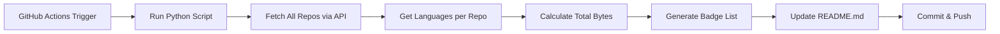

# 🚀 Complete Setup Guide - Auto-Updating GitHub Profile

Panduan lengkap untuk setup auto-update tech stack di GitHub Profile README.

## 📋 Apa yang Akan Auto-Update?

### ✅ Sudah Auto-Update (Tidak Perlu Setup)
- **Most Used Languages** - Sudah otomatis dari GitHub API
- **GitHub Stats** - Real-time dari github-readme-stats API
- **Contribution Graph** - Real-time dari GitHub
- **GitHub Streak** - Real-time
- **Profile Views** - Real-time counter

### 🤖 Akan Kita Setup untuk Auto-Update
- **Tech Stack & Tools Section** - Deteksi otomatis dari semua repo Anda

---

## 🛠️ Installation Steps

### Step 1: Setup Repository Structure

Di repository `Kyugito666/Kyugito666` Anda, buat struktur folder berikut:

```
Kyugito666/
├── .github/
│   └── workflows/
│       └── update-readme.yml    # File workflow
├── README.md                     # File README utama
└── update_readme.py             # Script Python
```

### Step 2: Upload Files

1. **Copy `README.md`** yang sudah saya buat (dari artifact pertama)
2. **Copy `update_readme.py`** (dari artifact kedua)
3. **Copy `.github/workflows/update-readme.yml`** (dari artifact ketiga)

### Step 3: Commit & Push

```bash
git add .
git commit -m "🤖 Setup auto-update tech stack"
git push
```

### Step 4: Test Manual Run

1. Buka repository di GitHub
2. Klik tab **"Actions"**
3. Klik workflow **"Update README with Latest Tech Stack"**
4. Klik tombol **"Run workflow"**
5. Pilih branch `main`
6. Klik **"Run workflow"**

Tunggu beberapa detik, workflow akan:
- Scan semua repository Anda
- Detect bahasa yang digunakan
- Update section Tech Stack di README
- Commit changes otomatis

---

## ⚙️ Configuration Options

### Mengatur Jadwal Update

Edit file `.github/workflows/update-readme.yml`:

```yaml
on:
  schedule:
    # Default: Setiap hari jam 00:00 UTC (07:00 WIB)
    - cron: '0 0 * * *'
    
    # Alternatif jadwal:
    # - cron: '0 */6 * * *'    # Setiap 6 jam
    # - cron: '0 0 * * 0'      # Setiap minggu (Minggu)
    # - cron: '0 0 1 * *'      # Setiap bulan (tanggal 1)
```

### Menambah/Mengubah Tech Stack Tetap

Edit file `update_readme.py`, bagian `STATIC_TECH`:

```python
STATIC_TECH = {
    'DevOps & Cloud': [
        'https://img.shields.io/badge/Docker-2496ED?style=for-the-badge&logo=docker&logoColor=white',
        # Tambah tech lain di sini
    ],
    'Tools & Environment': [
        'https://img.shields.io/badge/Linux-FCC624?style=for-the-badge&logo=linux&logoColor=black',
        # Tambah tool lain di sini
    ]
}
```

### Menambah Bahasa Baru ke Database

Edit file `update_readme.py`, bagian `LANGUAGE_BADGES`:

```python
LANGUAGE_BADGES = {
    'NamaBahasa': {
        'badge': 'URL_BADGE_SHIELDS_IO',
        'category': 'Languages & Frameworks'  # atau 'DevOps & Cloud' atau 'Tools & Environment'
    },
}
```

**Contoh menambah Zig:**

```python
'Zig': {
    'badge': 'https://img.shields.io/badge/Zig-F7A41D?style=for-the-badge&logo=zig&logoColor=white',
    'category': 'Languages & Frameworks'
},
```

Cari badge di: https://shields.io/ atau https://simpleicons.org/

---

## 🔧 Troubleshooting

### Issue: Workflow tidak berjalan

**Solusi:**
1. Pastikan workflow file ada di `.github/workflows/update-readme.yml`
2. Periksa di tab Actions apakah workflow muncul
3. Coba manual trigger dulu

### Issue: "Permission denied" saat commit

**Solusi:**
1. Buka Settings repository → Actions → General
2. Scroll ke "Workflow permissions"
3. Pilih **"Read and write permissions"**
4. Centang **"Allow GitHub Actions to create and approve pull requests"**
5. Save

### Issue: Rate limit GitHub API

**Solusi:**
Script sudah menggunakan `GITHUB_TOKEN` otomatis dari Actions, jadi rate limit lebih tinggi (5000 requests/hour). Tidak perlu setup tambahan.

### Issue: Bahasa tidak terdeteksi

**Kemungkinan penyebab:**
1. Bahasa belum ada di `LANGUAGE_BADGES` dictionary
2. Repository adalah fork (fork di-skip otomatis)

**Solusi:**
Tambahkan bahasa ke dictionary `LANGUAGE_BADGES` di `update_readme.py`

---

## 📊 Cara Kerja System



### Detail Proses:

1. **GitHub Actions** dijalankan sesuai schedule atau manual
2. **Python Script** menggunakan GitHub API untuk:
   - Ambil semua repository (exclude forks)
   - Ambil languages untuk setiap repo
   - Hitung total bytes per bahasa
3. **Generate Badges**:
   - Sort bahasa berdasarkan total bytes
   - Match dengan database badge
   - Combine dengan static tech
   - Group by category
4. **Update README**:
   - Replace section Tech Stack dengan yang baru
   - Preserve bagian lain
5. **Auto Commit**:
   - Commit dengan message `🤖 Auto-update tech stack [skip ci]`
   - Push ke branch main

---

## 🎨 Customization Ideas

### Ide 1: Filter Repository

Tambahkan filter untuk exclude repo tertentu:

```python
def get_all_repos(username, token=None):
    # ... existing code ...
    
    # Filter out repos
    exclude_repos = ['repo-name-1', 'repo-name-2']
    repos = [r for r in repos if r['name'] not in exclude_repos]
    
    return repos
```

### Ide 2: Tambah Minimum Threshold

Hanya tampilkan bahasa dengan minimum bytes:

```python
def analyze_all_repos(username, token=None):
    # ... existing code ...
    
    # Filter by minimum bytes (e.g., 1000 bytes)
    language_bytes = {k: v for k, v in language_bytes.items() if v >= 1000}
    
    return language_bytes
```

### Ide 3: Tambah Section Baru

Tambahkan section untuk frameworks/libraries:

```python
# Di LANGUAGE_BADGES, tambah category baru
'React': {
    'badge': 'https://img.shields.io/badge/React-20232A?style=for-the-badge&logo=react&logoColor=61DAFB',
    'category': 'Frontend Frameworks'
},
```

---

## 📈 Monitoring

### Melihat Workflow Runs

1. Buka repository → Tab **Actions**
2. Klik workflow "Update README with Latest Tech Stack"
3. Lihat history runs dan status (✅ success / ❌ failed)
4. Klik run untuk melihat detail logs

### Notifications

GitHub akan email Anda jika workflow gagal. Untuk disable:
- Settings → Notifications → Actions → Uncheck "Send notifications for failed workflows"

---

## 🚀 Advanced Features

### Feature 1: Tambah Stats per Language

Modifikasi script untuk menampilkan persentase:

```python
def generate_tech_stack_section(languages):
    total_bytes = sum(languages.values())
    
    section = "### 💻 Tech Stack & Tools\n\n"
    section += "**Language Usage:**\n"
    
    for lang, bytes_count in sorted(languages.items(), key=lambda x: x[1], reverse=True)[:5]:
        percentage = (bytes_count / total_bytes) * 100
        section += f"- {lang}: {percentage:.1f}%\n"
    
    section += "\n"
    # ... rest of code
```

### Feature 2: Integration dengan Discord Webhook

Tambahkan notifikasi ke Discord saat README update:

```yaml
# Di update-readme.yml, tambah step:
- name: Notify Discord
  if: steps.check_changes.outputs.changed == 'true'
  env:
    DISCORD_WEBHOOK: ${{ secrets.DISCORD_WEBHOOK }}
  run: |
    curl -H "Content-Type: application/json" \
         -d '{"content": "✅ GitHub Profile README updated with latest tech stack!"}' \
         $DISCORD_WEBHOOK
```

Setup:
1. Buat Discord Webhook di server settings
2. Add secret `DISCORD_WEBHOOK` di repository settings

### Feature 3: Generate Summary Report

Tambah file output dengan detail changes:

```python
def generate_report(languages, output_file='tech_report.md'):
    with open(output_file, 'w') as f:
        f.write("# Tech Stack Report\n\n")
        f.write(f"Generated: {datetime.now()}\n\n")
        f.write("## Detected Languages:\n\n")
        
        for lang, bytes_count in sorted(languages.items(), key=lambda x: x[1], reverse=True):
            f.write(f"- **{lang}**: {bytes_count:,} bytes\n")
```

---

## 🔐 Security Best Practices

### 1. Token Management
- ✅ Workflow sudah menggunakan `GITHUB_TOKEN` otomatis
- ✅ Tidak perlu Personal Access Token
- ✅ Token auto-generated per workflow run

### 2. Repository Permissions
- ✅ Workflow hanya akses repository sendiri
- ✅ Read-only untuk public repos
- ✅ Write hanya untuk README.md

### 3. Commit Safety
- ✅ Commit message include `[skip ci]` untuk prevent loop
- ✅ Bot user untuk commits
- ✅ Verified commits dari GitHub Actions

---

## 📱 Integration dengan GitHub Mobile

### Melihat Workflow di Mobile

1. Install GitHub Mobile App
2. Navigate ke repository
3. Tap menu → Actions
4. Lihat workflow runs real-time
5. Trigger manual dari mobile!

### Push Notifications

Enable di app settings untuk dapat notif saat workflow selesai.

---

## 🎯 Performance Optimization

### Tip 1: Cache Python Dependencies

Update workflow untuk cache dependencies:

```yaml
- name: Cache pip packages
  uses: actions/cache@v3
  with:
    path: ~/.cache/pip
    key: ${{ runner.os }}-pip-${{ hashFiles('**/requirements.txt') }}
    restore-keys: |
      ${{ runner.os }}-pip-
```

### Tip 2: Conditional Execution

Hanya run jika ada repo baru atau perubahan besar:

```python
def should_update(current_langs, new_langs):
    """Check if update is significant enough"""
    # Only update if new language detected or major change
    new_detected = set(new_langs.keys()) - set(current_langs.keys())
    return len(new_detected) > 0 or abs(len(new_langs) - len(current_langs)) > 2
```

### Tip 3: Rate Limit Handling

Script sudah handle rate limit, tapi bisa ditambah retry logic:

```python
import time

def get_with_retry(url, headers, max_retries=3):
    for i in range(max_retries):
        response = requests.get(url, headers=headers)
        if response.status_code == 200:
            return response
        elif response.status_code == 429:  # Rate limited
            time.sleep(60)  # Wait 1 minute
        else:
            break
    return response
```

---

## 📚 Resources & References

### Badge Generators
- [Shields.io](https://shields.io/) - Custom badge generator
- [Simple Icons](https://simpleicons.org/) - Icon library
- [Badges 4 README](https://github.com/alexandresanlim/Badges4-README.md-Profile) - Badge collection

### GitHub APIs
- [GitHub REST API](https://docs.github.com/en/rest) - Official documentation
- [Languages API](https://docs.github.com/en/rest/repos/repos#list-repository-languages) - Language detection

### Similar Projects
- [github-readme-stats](https://github.com/anuraghazra/github-readme-stats)
- [github-profile-readme-generator](https://github.com/rahuldkjain/github-profile-readme-generator)

### Cron Expression Helper
- [Crontab Guru](https://crontab.guru/) - Cron schedule expression editor

---

## 🐛 Common Issues & Solutions

### Issue: Script timeout

**Error:** "The job running on Actions took too long"

**Solusi:**
```yaml
jobs:
  update-readme:
    runs-on: ubuntu-latest
    timeout-minutes: 10  # Tambah timeout limit
```

### Issue: Badge tidak muncul

**Kemungkinan:**
1. URL badge salah
2. Service shields.io down

**Solusi:**
- Cek URL badge di browser
- Gunakan badge alternatif dari img.shields.io

### Issue: Merge conflict

**Error:** "Merge conflict in README.md"

**Solusi:**
```bash
# Pull latest changes
git pull origin main

# Re-run script locally
python update_readme.py

# Commit and push
git add README.md
git commit -m "Fix: resolve merge conflict"
git push
```

### Issue: Wrong language detection

**Contoh:** Jupyter Notebook terdeteksi sebagai JSON

**Solusi:**
Tambahkan filter di script:

```python
# Ignore certain languages
IGNORED_LANGUAGES = ['Jupyter Notebook', 'JSON', 'XML']

def analyze_all_repos(username, token=None):
    # ... existing code ...
    
    # Filter ignored languages
    language_bytes = {k: v for k, v in language_bytes.items() 
                     if k not in IGNORED_LANGUAGES}
    
    return language_bytes
```

---

## 🎓 Next Steps

### Level Up Your Profile

1. **Add Wakatime Stats**
   - Show coding time per language
   - Weekly coding activity
   - [Setup Guide](https://github.com/anmol098/waka-readme-stats)

2. **Add Spotify Now Playing**
   - Show current listening
   - [Spotify GitHub Profile](https://github.com/kittinan/spotify-github-profile)

3. **Add Blog Posts Feed**
   - Auto-update latest blog posts
   - [Blog Post Workflow](https://github.com/gautamkrishnar/blog-post-workflow)

4. **Add Dev.to Articles**
   - Show your latest articles
   - [Dev.to API](https://developers.forem.com/api)

### Contribute Back

Jika Anda improve script ini:
1. Fork dan buat improvements
2. Share di GitHub discussions
3. Help others dalam issues

---

## 💬 Support & Community

### Get Help

- 🐛 **Bug Reports**: Open issue di repository
- 💡 **Feature Requests**: GitHub Discussions
- 📧 **Direct Contact**: siti007.sj@gmail.com
- 💬 **Chat**: [Telegram](https://t.me/i011100110110010101100101u)

### Share Your Profile

Jika setup ini berhasil, share profile GitHub Anda! 
Tag: `#github-profile-automation` `#readme-automation`

---

## 📄 License

Script dan setup guide ini adalah MIT Licensed.
Free to use, modify, and distribute!

```
MIT License

Copyright (c) 2024-2025 Kyugito666

Permission is hereby granted, free of charge, to any person obtaining a copy
of this software and associated documentation files (the "Software"), to deal
in the Software without restriction, including without limitation the rights
to use, copy, modify, merge, publish, distribute, sublicense, and/or sell
copies of the Software, and to permit persons to whom the Software is
furnished to do so, subject to the following conditions:

The above copyright notice and this permission notice shall be included in all
copies or substantial portions of the Software.

THE SOFTWARE IS PROVIDED "AS IS", WITHOUT WARRANTY OF ANY KIND, EXPRESS OR
IMPLIED, INCLUDING BUT NOT LIMITED TO THE WARRANTIES OF MERCHANTABILITY,
FITNESS FOR A PARTICULAR PURPOSE AND NONINFRINGEMENT. IN NO EVENT SHALL THE
AUTHORS OR COPYRIGHT HOLDERS BE LIABLE FOR ANY CLAIM, DAMAGES OR OTHER
LIABILITY, WHETHER IN AN ACTION OF CONTRACT, TORT OR OTHERWISE, ARISING FROM,
OUT OF OR IN CONNECTION WITH THE SOFTWARE OR THE USE OR OTHER DEALINGS IN THE
SOFTWARE.
```

---

## 🎉 Changelog

### Version 1.0.0 (Initial Release)
- ✅ Auto-detect languages from all repositories
- ✅ Auto-update Tech Stack section
- ✅ Daily scheduled runs
- ✅ Manual trigger support
- ✅ Categorized tech stack display
- ✅ Skip forked repositories
- ✅ Rate limit handling

### Future Improvements
- [ ] Add language percentage display
- [ ] Integration with Wakatime
- [ ] Discord webhook notifications
- [ ] Weekly summary reports
- [ ] Support for private repositories
- [ ] Custom category configuration

---

<div align="center">

**Happy Coding! 🚀**

Made with ❤️ by [Kyugito666](https://github.com/Kyugito666)

</div>
